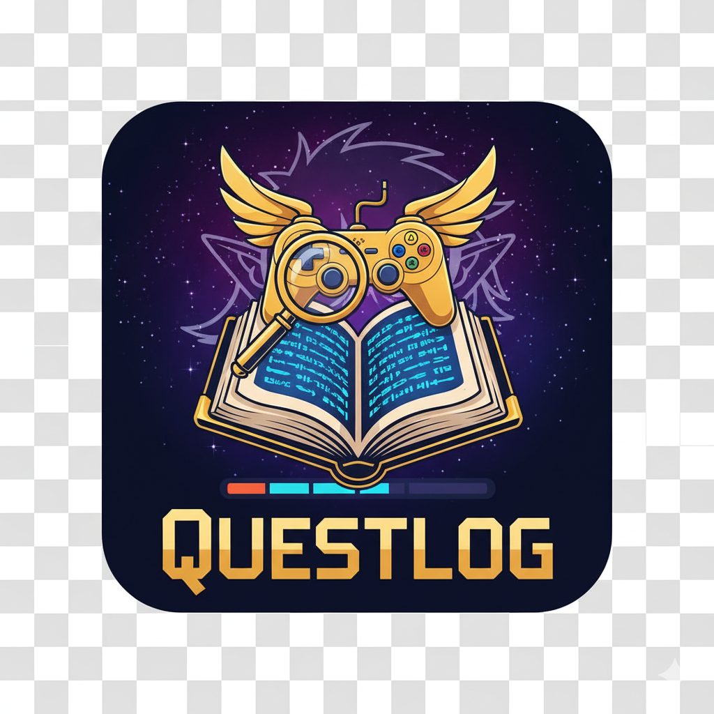

# 🛡️ Questlog



**Questlog** es una plataforma social para *gamers* y *otakus* que permite llevar un registro detallado de videojuegos y animes, interactuar con una comunidad y gestionar colecciones personales. Combina lo mejor de una red social con bases de datos especializadas.

## 🚀 Características Principales

### 🌟 Social y Comunidad
* **Sistema de Perfiles:** Personalización de avatares y seguimiento de usuarios (*Follow/Unfollow*).
* **Feed de Actividad:** Descubre qué están jugando o viendo tus amigos en tiempo real.
* **Interacciones:** Sistema de *Likes*, comentarios y valoración de contenido útil.

### 🎮 Integraciones (APIs Externas)
Questlog se conecta con bases de datos reales para ofrecer contenido actualizado:
* **Videojuegos:** Integración con **[RAWG API](https://rawg.io/apidocs)** para buscar y añadir juegos a tu biblioteca.
* **Anime/Manga:** Integración con **[Jikan API](https://jikan.moe/)** (MyAnimeList) para el seguimiento de series.

### ⚔️ Gestión de Colecciones
* **Listas Personales:** Clasifica tus ítems en "Jugando", "Completado", "Deseado", etc.
* **Progreso:** Marca episodios vistos o porcentaje de juego completado.

### 🛒 Tienda y E-commerce
* **Tienda Integrada:** Carrito de compras y simulación de pedidos.
* **Facturación:** Generación automática de facturas en PDF tras la "compra".
* **Lista de Deseos:** Guarda productos para futuras adquisiciones.

---

## 💻 Tecnologías Utilizadas

Arquitectura híbrida moderna:

* **Backend:** [PHP 8.2+](https://www.php.net/), [Laravel 11](https://laravel.com/)
* **Frontend:**
  * **Blade:** Motor de plantillas principal.
  * **React.js:** Componentes avanzados (Buscador dinámico, Notificaciones).
  * **Livewire:** Interactividad en tiempo real (Botones sociales, Carrito).
  * **Alpine.js:** Micro-interacciones de interfaz.
  * **Tailwind CSS:** Diseño responsivo y moderno.
* **Base de Datos:** MySQL (Compatible con XAMPP/MariaDB)

---
## 📚 Documentación
* [Manual de Instalación (PDF)](Manual_de_instalacion.pdf)
* [Manual de Usuario (PDF)](Manual_de_Usuario.pdf)

## ⚙️ Instalación Rápida

Para una guía detallada, consulta el documento `Manual de instalación.docx` incluido en este repositorio.

1. **Clonar y preparar:**
   ```bash
   git clone [https://github.com/alon1813/questlog.git](https://github.com/alon1813/questlog.git)
   cd questlog
   composer install
   npm install && npm run build